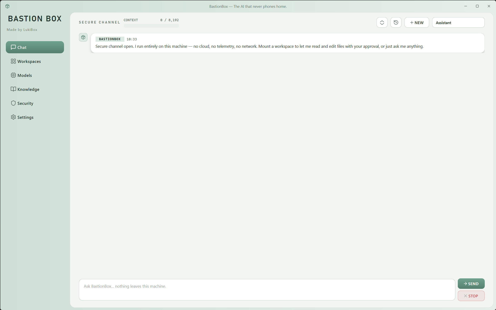
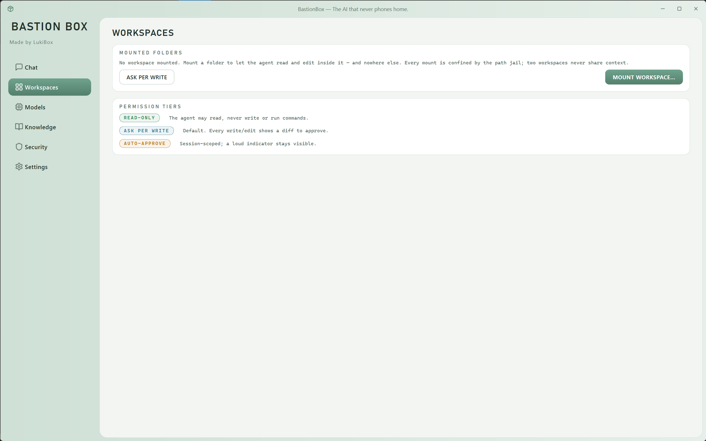
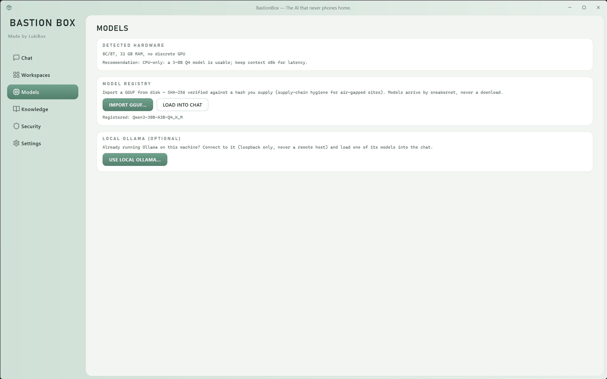
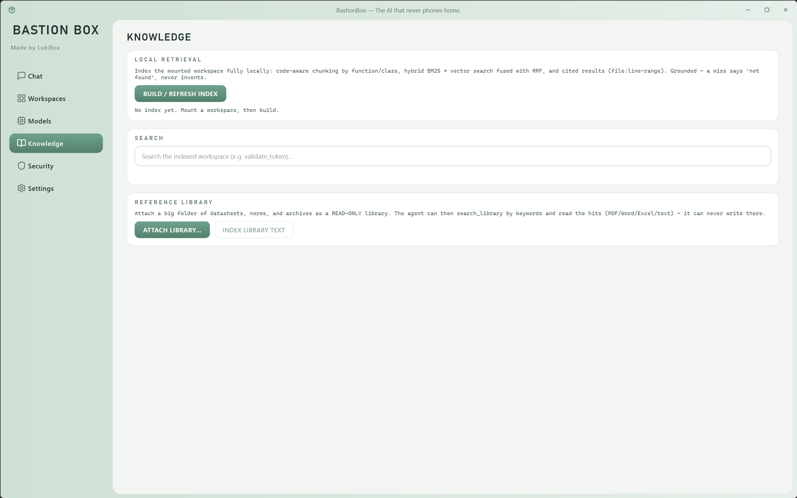
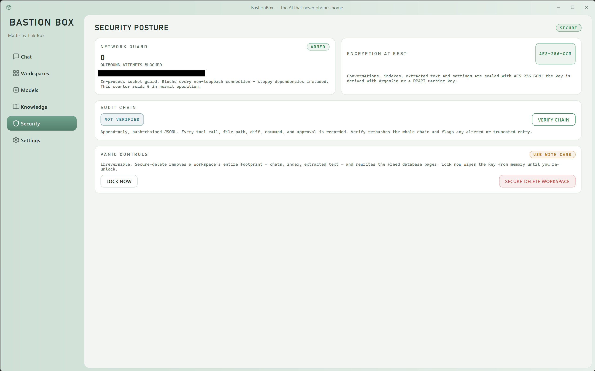
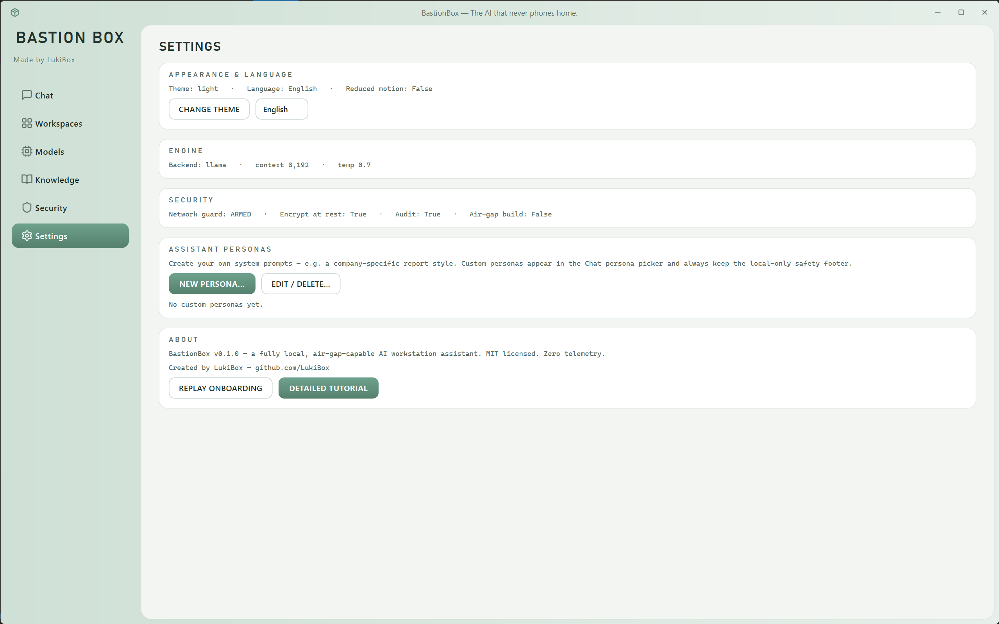

<div align="center">

# BastionBox

### A private AI assistant for your files and code — capable, offline, and it never phones home

BastionBox gives you a chat model and a permissioned agent that run entirely on your own machine. Read and summarize PDFs, Word, and Excel; write polished reports with charts; edit files in folders you approve (with a diff you sign off on first); search your own documents — all with a tamper-evident record of everything it did. It's written in Python 3.10+ with a PySide6 UI, runs 100% offline, speaks English and Polish, and ships under the MIT license.


-41CD52?logo=qt&logoColor=white)


</div>

---

## Who is BastionBox for?

For anyone whose documents or code simply must not leave the building — defense and aerospace, legal, medical, finance, classified-adjacent work, or a developer who refuses to ship their IP to an API. Cloud assistants are capable, but they send your data to someone else's servers. BastionBox keeps the same chat-and-agent workflow and runs the model on your own hardware instead.

The honest part: local models are weaker than the big cloud ones, and BastionBox doesn't pretend otherwise. It makes up the difference with engineering — grammar-constrained tool calls, a planning notepad, tight retrieval instead of giant contexts, and a diff you approve before anything is written. The promise isn't "a frontier model at home"; it's *a trustworthy assistant that provably never phones home.*

---

## Screenshots

<div align="center">

**Chat — a fully local conversation; nothing leaves the machine**



**Workspaces — mount a folder for the agent and choose its permission tier**



**Models — import a GGUF (SHA-256 verified) or connect a local Ollama**



**Knowledge — index your workspace and attach a read-only reference library**



**Security — network guard, encryption at rest, tamper-evident audit, panic controls**



**Settings — theme, language, engine, personas, and an honest About**



</div>

---

## Features

Local chat — load any GGUF model through the embedded llama.cpp runtime, or connect a local Ollama. Streaming replies, switchable personas, bilingual.

Permissioned agent — reads, writes, and edits files inside workspaces you mount. Every write is shown as a diff you approve before a single byte touches disk, and a rejection just becomes feedback the model adapts to.

Document workflows — read PDF, Word, Excel, and CSV, then write polished `.docx`, `.pdf`, `.html`, or `.xlsx` reports with charts, tables, and embedded photos. HTML reports are self-contained, so you can email one file.

Exact tools, not guesses — a math evaluator does all the arithmetic (so a report's numbers are right, not model-estimated), and a duplicate-file finder hashes and groups files for you, catching identical content even under different names.

Reference library — attach a big folder read-only, then search datasheets and standards by keyword and cite them, without the agent ever being able to write there.

Security walls, built first — a path jail (the agent can't reach anything outside a mounted workspace), an in-process network guard (blocks any outbound connection), a tamper-evident hash-chained audit log, and AES-256-GCM encryption at rest.

Reliable multi-step work — a planning notepad keeps the agent's plan and findings in front of it even on long jobs, and it can pause to ask you a clarifying question when it's genuinely stuck.

Bilingual UI — English by default; switch to Polish with one click (the choice is remembered).

Everything runs locally. Nothing leaves your computer — not even the model.

---

## Quick start

```powershell
# 1. Clone the repository
git clone https://github.com/LukiBox/BastionBox.git
cd BastionBox

# 2. Virtual environment
python -m venv .venv
.venv\Scripts\Activate.ps1

# 3. Dependencies
pip install -r requirements.txt

# 4. Run
python -m bastion.app
```

### Loading a model (choose one)

Both paths are fully local and private:

- **Embedded llama.cpp** — import any `.gguf` file from the **Models** tab. Nothing else to install; the model is just a file on disk.
- **Ollama** — install [Ollama](https://ollama.com), then:

```powershell
ollama pull qwen3:30b-a3b
ollama serve
```

BastionBox detects running Ollama models automatically. There's no cap on model size — a 30B model runs well on a strong laptop, and larger models work if your machine can hold them.

---

## Building the executable (.exe)

```powershell
pip install pyinstaller
pyinstaller bastion.spec --noconfirm
```

Produces `dist/BastionBox/BastionBox.exe` with the Office libraries and the embedded llama.cpp runtime bundled. For a hardened, network-free distribution that **excludes** the networking modules entirely (so the capability is absent, not merely disabled), build with `bastion-airgap.spec` instead.

---

## Architecture

```
bastion/
  app.py                    # entry point — installs the network guard, then the UI
  core/
    i18n.py                 # lightweight English/Polish translation
    security/               # the load-bearing walls: jail, netguard, audit, crypto
    llm/                    # engine layer: llama.cpp + Ollama, grammar, hardware plan
    agent/                  # the agent loop, personas, permissions, diffing
    tools/                  # jailed file/office/search/library/math tools
    docs/                   # document read + write (docx / pdf / html / xlsx, charts)
    index/                  # hybrid retrieval (chunker + BM25 + vectors)
    store/                  # encrypted conversation + settings store
  ui/
    main_window.py          # window, navigation, theme, onboarding, language switch
    chat/                   # chat view, agent worker thread, diff + approval dialogs
    tabs/  widgets/  palette/   # workspaces, models, knowledge, security, quick-ask
  resources/
    styles/                 # generated Qt stylesheet (soft-tactical theme)
    fonts/
tests/                      # pytest — the security suite gates every change
```

| Layer | Technology |
|---|---|
| UI | PySide6 (Qt6) |
| Local models | llama.cpp (embedded, any GGUF) + Ollama (loopback-only) |
| Documents | python-docx, openpyxl, pypdf, PyMuPDF, ReportLab |
| Retrieval | SQLite FTS5 (BM25) + vector cosine, fused |
| Security | path jail, in-process network guard, hash-chained audit, AES-256-GCM |
| Packaging | PyInstaller |

---

## How it works

- **Security is the architecture.** Three walls come first and gate every feature: a **path jail** resolves every file path so the agent can't escape a mounted workspace, an **in-process network guard** is installed before anything else and blocks outbound sockets, and a **hash-chained audit log** makes tampering evident. The store is encrypted with AES-256-GCM (Argon2id key derivation).
- **The engine layer** abstracts the model: embedded **llama.cpp** loads any GGUF from disk (the air-gap-capable primary), and an optional **Ollama** backend is loopback-only. Context size is fitted to your RAM automatically.
- **The agent loop** forces every tool call into valid JSON with a GBNF grammar, keeps a planning notepad that survives context trimming, verifies its own edits, and streams live progress so a long step never looks frozen.
- **Retrieval** indexes your codebase or document set with SQLite FTS5 (BM25) plus vector similarity, fused so answers come with real `file:line` citations instead of a giant context dump.

---

## Engineering notes

- **The air-gap guarantee is real and load-bearing.** Nothing in the default build reaches the network; the optional Ollama backend is restricted to loopback. A remote/cloud model would, by definition, break that guarantee — so it isn't included.
- **Local models are honest about their limits.** Where a task needs exact numbers, BastionBox uses a deterministic math tool rather than trusting the model; where a document is long, it reads page-by-page within a budget rather than overflowing the context.
- **The security suite is the gate.** `pytest` runs the jail, netguard, audit, and crypto tests on every change — the walls are proven, not assumed.

---

## 📜 License

BastionBox code: **MIT** (see [LICENSE](LICENSE)). Authored by **LukiBox**.

---

<div align="center">

Everything on your machine. Nothing phones home.

</div>
